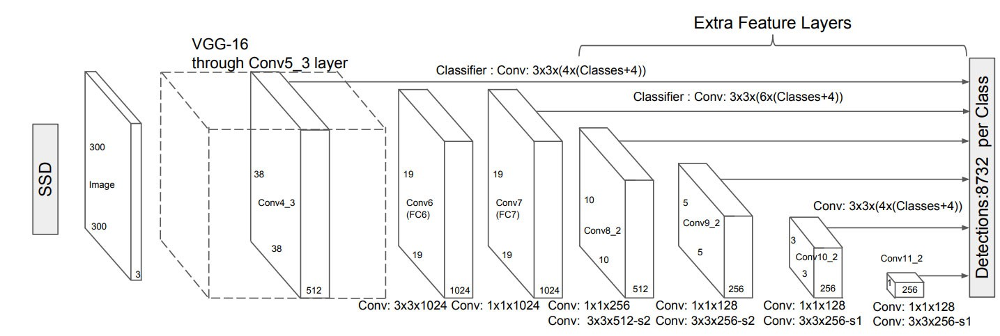

# SSD People Detector With ROS
    작성일 2019년 11월 18일   
    작성자 황인재

    최종 수정 2019년 12월 8일 
---
## 0. 네트워크 


      한장의 사진이 들어 가고 사람의 크기에 따라 7가지 피쳐맵이 적용되며   
      결과적으로 검출된 박스의 class와 프레임상의 비율적 위치가 출력으로 나온다.


---
## 1. 설명
- SSD(single shot multi detector)를 이용한 people_detector 
- 카메라 노드의 토픽을 받아 SSD네트워크를 통과하고 사람들의 위치정보를 MsgState.msg 토픽으로 퍼블리시 한다. 
- 퍼블리시 되는 토픽  MsgState.msg 는 다음과 같다.
  ```python
  float64 x_mid
  float64 y_mid
  float64 box_size
  int32 box_count
  ```
  이를 그림으로 나타내면  

  


---
## 2. 설치과정
### 1)ROS 설치

    Install ROS: http://wiki.ros.org/kinetic/Installation/Ubuntu  

### 2)카메라 설치   

>~$ sudo apt-get install ros-kinetic-usb-cam
  
    kinetic 대신 자신의 버전 입력할 것

### 3)가상환경 설치 후 텐서플로우 설치

>~$ sudo apt-get install python-pip python-dev python-virtualenv  

>~$ virtualenv --system-site-packages ~/tensorflow  

>~$ source ~/tensorflow/bin/activate  

>~$ easy_install -U pip  

>~$ pip install --upgrade tensorflow  
  
    설치가 안된다면 다른 방법으로 설치 해도 무관함
  
### 4)ROS 설정   
>~$ mkdir ~/catkin_ws/ && mkdir ~/catkin_ws/src/
### 5)패키지 클론 vision_msgs 및 ssd_people_detector_ros 
>~$ cd ~/catkin_ws/src

>~$ git clone https://github.com/HY-HIGH/vision_msgs.git  

>~$ git clone https://github.com/HY-HIGH/ssd_people_detector_ros.git

### 6) ROS catkin make
>~$ cd ~/catkin_ws && catkin_make
     
### 7) ROS 설정
    ##다음 밑의 항목들을 .bashrc 에 추가 해준다.    
    ##.bashrc 수정방법 <커맨드에 gedit ~/.bashrc 입력>

    alias rldetect='roslaunch ssd_people_detector_ros  usb_cam_detector.launch'    

    source ~/catkin_ws/devel/setup.bash    

    alias at='source ~/tensorflow/bin/activate'
--- 
## 사용방법
---
### Terminal (ctrl+t)
>~$ at  

    가상환경 tensorflow 로 변경
>~$ rldetect
  
    ssd_people_detector_ros 실행
### 서브스크라이브 하는 카메라 이미지 토픽 변경
- ssd_people_detector_ros 폴더내의 launch 폴더로 이동
- usb_cam_detector.launch 파일을 수정한다
- 아래와 같이 첫번째 노드의 ```<remap>``` 부분을 수정 해준다. 
```xml
    <launch>
	<node pkg= "tensorflow_object_detector" name="detect_ros"  type="detect_ros.py"  output="screen"> 
    <remap from="image" to="/usb_cam_node/image_raw"/>
    <!-- <remap from="image" to="/iitp_drone/camera_1/image_raw"/> -->
    <!-- 드론이용시 /iitp_drone/camera_1/image_raw -->
    <!-- 웹 캠이용시 /usb_cam_node/image_raw -->
	</node>

  <node pkg="usb_cam" type="usb_cam_node" name="usb_cam_node" output="screen">
    <param name="pixel_format" value="yuyv"/>
    <!-- 외장 웹캠 이용시 -->
    <param name="video_device" value="/dev/video1"/>
    <!-- 내장 웹캠 이용시 -->
    <!-- <param name="video_device" value="/dev/video0"/> -->
    
  </node>

  <node pkg="image_view" type="image_view" name="image_view">
    <remap from="image" to="debug_image"/>
  </node>
</launch>
```
---
## 3. 주요 코드 수정 사항
### 메인 실행 코드
> cd ./scripts  
  
    detect_ros.py 
- 사람들의 위치정보를 박스 값으로 퍼블리시 해준다.
```python
def visualize_boxes_and_labels_on_image_array(image,
                                              boxes,
                                              classes,
                                              scores,
                                              category_index,
                                              instance_masks=None,
                                              keypoints=None,
                                              use_normalized_coordinates=False,
                                              max_boxes_to_draw=20,
                                              min_score_thresh=.15,
                                              agnostic_mode=False,
                                              line_thickness=4):
  

  box_to_display_str_map = collections.defaultdict(list)
  box_to_ID_score=collections.defaultdict(list)
  box_to_color_map = collections.defaultdict(str)
  box_to_instance_masks_map = {}
  box_to_keypoints_map = collections.defaultdict(list)
  class_name ='N/A'#기본 설정 class 가 잡히지 않을때 꺼지는 현상 방지.
  # a=0
  data = []
  if not max_boxes_to_draw:
    max_boxes_to_draw = boxes.shape[0]
  for i in range(min(max_boxes_to_draw, boxes.shape[0])):#박스 개수 만큼 for 문을 돈다.
  ## 주요 수정 코드
  ##사람만을 detect 하도록 한다.
    if category_index[classes[i]]['name'] == 'person' : 
      if scores is None or scores[i] > min_score_thresh:
        box = tuple(boxes[i].tolist())

        if instance_masks is not None:
          box_to_instance_masks_map[box] = instance_masks[i]
        if keypoints is not None:
          box_to_keypoints_map[box].extend(keypoints[i])
        if scores is None:
          box_to_color_map[box] = 'black'
        else:
          if not agnostic_mode:
            if classes[i] in category_index.keys():
              class_name = category_index[classes[i]]['name']
              class_id = category_index[classes[i]]['id']
              class_score = scores[i]
            else:
              class_name = 'N/A'
            display_str = '{}: {}%'.format(
                class_name,
                int(100*scores[i]))
          else:
            display_str = 'score: {}%'.format(int(100 * scores[i]))
          box_to_display_str_map[box].append(display_str)
          # box_to_ID_score[box].append(class_id)
          data.append([class_id,class_score,box,])

          # print(box_to_ID_score[box])
          if agnostic_mode:
            box_to_color_map[box] = 'DarkOrange'
          else:
            box_to_color_map[box] = STANDARD_COLORS[
                classes[i] % len(STANDARD_COLORS)]
  xmid=0
  ymid=0
  box_size=0
  box_count =0
  if class_name=='person':
    for box, color in box_to_color_map.items():
      ymin, xmin, ymax, xmax = box
      xmid += (xmin+xmax)/2
      ymid += (ymin+ymax)/2
        
      box_size +=((ymax-ymin)*(xmax-xmin))
      
      if instance_masks is not None:
        draw_mask_on_image_array(
            image,
            box_to_instance_masks_map[box],
            color=color
        )
    
      draw_bounding_box_on_image_array(
          image,
          ymin,
          xmin,
          ymax,
          xmax,
          color=color,
          thickness=line_thickness,
          display_str_list=box_to_display_str_map[box],
          use_normalized_coordinates=use_normalized_coordinates)
      if keypoints is not None:
        draw_keypoints_on_image_array(
            image,
            box_to_keypoints_map[box],
            color=color,
            radius=line_thickness / 2,
            use_normalized_coordinates=use_normalized_coordinates)
      box_count += 1
      
  if box_count != 0:
    print("xmid: %f, ymid: %f," %(xmid/box_count,ymid/box_count))
    print("box_size:%f"%(box_size/box_count))
    print("box_count:%d"%(box_count))
    print(display_str)
    return (data) ,xmid/box_count ,ymid/box_count ,box_count, box_size/box_count

  else:
    return (data) ,-1 ,-1 ,box_count, box_size

```

## 4. 참고
    직접 모델 수정시 다음 방법을 참고한다.

      1. Download any Object Detection Models from the Tensorflow Object detection API and place it in data/models/ .   
      You
      can find the models in tensorflow Object Detection Model Zoo:
      https://github.com/tensorflow/models/blob/master/object_detection/g3doc/detection_model_zoo.md. Extract the tar.gz
      file.
      2. Edit the MODEL_NAME and LABEL_NAME in detect_ros.py. By default it is ssd_mobilenet_v1_coco_11_06_2017 with
      mscoco_label_map.pbtxt respectively.

      from.osrf/tensorflow_object_detector: Tensorflow Object Detector

